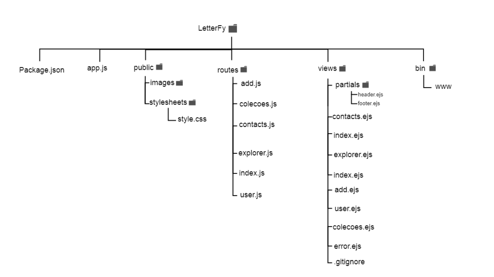

# 🎧 LetterFy

Um site inspirado na funcionaldade do Letterboxd — mas focado em música!  
Projeto criado para a disciplina de programação web 1 no IFCE

---

## 🚀 Funcionalidades

- 📂 Visualização de coleções e criticas(explorer) em formato de cards
- ✏️ Templates dinâmicos com EJS
- ⚙️ Estrutura com Node.js e Express
- O perfil é apenas demonstração

---

## 💻 Tecnologias

- [Node.js](https://nodejs.org/)
- [Express](https://expressjs.com/)
- [EJS](https://ejs.co/)
- HTML5, CSS3, JavaScript

---

## 📁 Estrutura do Projeto

- Definir o layout (duas ou três colunas, fixo ou fluido)  
- Escolher e aplicar paleta de cores e fontes  
- Usar framework CSS, se quiser (ex: Bootstrap)  
- Criar HTML base com CSS incorporado  
- Planejar rotas em diagrama de árvore invertida  
- Iniciar projeto com Node.js, Express e Express-Generator  
- Criar todas as rotas necessárias  
- Usar template engine (EJS, Pug, etc) para renderizar views
- Implementar templates com partials para facilitar manutenção

---

## Diagrama 

